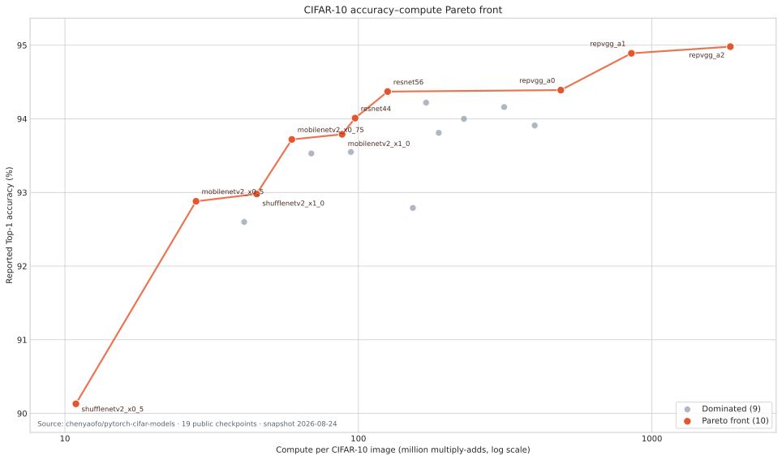

# chenyaofo CIFAR-10 모델 Pareto 분석

기준일: 2026-08-24  
출처: [`chenyaofo/pytorch-cifar-models`의 CIFAR-10 Model Zoo](https://github.com/chenyaofo/pytorch-cifar-models#model-zoo)

## 분석 기준

공개 저장소의 CIFAR-10 표에 있는 체크포인트 19개 전체를 사용했다. 정확도는 높을수록, 이미지 한 장당 연산량은 낮을수록 좋다고 정의했다.

모델 A가 모델 B보다 Top-1 정확도가 같거나 높고 MAdds가 같거나 낮으며, 두 조건 중 하나 이상이 엄격히 우수하면 A가 B를 지배한다. 어떤 다른 모델에도 지배되지 않는 모델을 Pareto front로 판정했다.

원 출처가 제공하는 연산 지표는 `#MAdds(M)`이므로 Pareto 판정에는 이 값을 직접 사용했다. CSV에는 프로젝트의 통일된 규칙인 `1 MAC = 2 FLOPs`로 환산한 MFLOPs도 함께 기록했다. 모든 연산량에 같은 양의 상수 2를 곱하므로 MAdds와 MFLOPs 중 어느 것을 사용해도 Pareto 판정은 같다.



## 결과

19개 체크포인트 중 10개가 Pareto front에 포함된다.

| 순서 | 모델 | Top-1 정확도 (%) | MAdds (M) | MFLOPs |
|---:|---|---:|---:|---:|
| 1 | `shufflenetv2_x0_5` | 90.13 | 10.90 | 21.80 |
| 2 | `mobilenetv2_x0_5` | 92.88 | 27.97 | 55.94 |
| 3 | `shufflenetv2_x1_0` | 92.98 | 45.00 | 90.00 |
| 4 | `mobilenetv2_x0_75` | 93.72 | 59.31 | 118.62 |
| 5 | `mobilenetv2_x1_0` | 93.79 | 87.98 | 175.96 |
| 6 | `resnet44` | 94.01 | 97.44 | 194.88 |
| 7 | `resnet56` | 94.37 | 125.75 | 251.50 |
| 8 | `repvgg_a0` | 94.39 | 489.08 | 978.16 |
| 9 | `repvgg_a1` | 94.89 | 851.33 | 1,702.66 |
| 10 | `repvgg_a2` | 94.98 | 1,850.10 | 3,700.20 |

## 모델 선정 해석

- 최저 연산량 경계는 `shufflenetv2_x0_5`다.
- 약 93% 정확도 구간에서는 `shufflenetv2_x1_0`, 약 94% 구간에서는 `resnet44`가 효율적이다.
- `resnet56`에서 `repvgg_a0`로 이동하면 MAdds가 약 3.9배 증가하지만 정확도 증가는 0.02%p뿐이다.
- `repvgg_a2`는 가장 높은 94.98%를 제공하지만 `repvgg_a1` 대비 정확도 증가는 0.09%p이고 MAdds는 약 2.17배다.
- VGG 계열 네 모델은 모두 다른 체크포인트에 지배되어 이 카탈로그의 accuracy–compute Pareto front에는 포함되지 않는다.

PERTINENCE의 전문가 풀을 정할 때 Pareto 여부만으로 최종 선택해서는 안 된다. 전체 정확도와 연산량이 지배되더라도 샘플별 오답 패턴이 상보적이면 시스템 정확도에 기여할 수 있다. 다음 단계에서는 Pareto 모델들의 CIFAR-10 샘플별 correctness matrix를 만든 뒤 overlap과 cheapest-correct route 분포를 함께 비교해야 한다.

## 산출물

- 전체 19개 모델과 Pareto 판정: [`data/chenyaofo_cifar10_models.csv`](../data/chenyaofo_cifar10_models.csv)
- 벡터 그림: [`figures/chenyaofo_cifar10_accuracy_madds_pareto.svg`](../figures/chenyaofo_cifar10_accuracy_madds_pareto.svg)
- 래스터 그림: [`figures/chenyaofo_cifar10_accuracy_madds_pareto.png`](../figures/chenyaofo_cifar10_accuracy_madds_pareto.png)
- 재생성 코드: [`scripts/build_chenyaofo_cifar10_pareto.py`](../scripts/build_chenyaofo_cifar10_pareto.py)

재생성 명령:

```bash
python3 scripts/build_chenyaofo_cifar10_pareto.py
```
