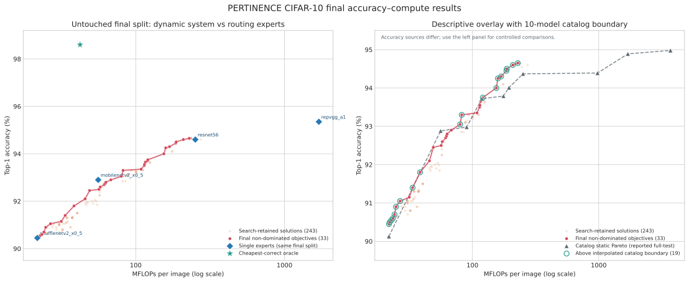

# PERTINENCE CIFAR-10 최종 실험 결과

## 결론

실험은 asset/cache gate, baseline, fixed dispatcher, 50세대 NSGA-II, untouched
final 2,000장 평가까지 완료됐다. Search에서 평가한 2,500개 해 중 243개가
search Pareto front로 보존됐고, 이를 모두 final split에 한 번씩 적용했다.

동일 final split에서 가장 의미 있는 결과는 ResNet56 기준선과 같은 94.60%를
유지하면서 평균 비용을 251.50에서 209.01 MFLOPs로 16.9% 줄인 해다. Final에서
관측한 최고 dynamic 정확도는 94.65% / 228.70 MFLOPs로, ResNet56보다 0.05pp
높고 비용은 9.1% 낮다. 다만 RepVGG-A1 단일 expert의 95.35%에는 도달하지 못했다.



## 실행 및 artifact 검증

- Search: 50 generations, 2,500 evaluations, 약 6시간 52분
- Search Pareto states: 243개, 모두 final에서 복원 성공
- Final samples: deterministic untouched 2,000장
- Final dispatcher checkpoints: 243개
- Search SHA-256:
  `ab0ba4330e3c3bf5b6a5bb653c323d8a0cb72b5c558603d801ddf6e95d664867`
- Final SHA-256:
  `d9549724611a6824ac633073dd7bf8b4476f3ee12ffded96bfe1bfd8dd9b50d3`

분석기는 search/final cache fingerprint, retained evaluation ID, chromosome,
weighting, dispatcher state, confusion matrix와 selected count를 다시 대조한다.
243개 search-retained 해가 final 결과와 정확히 일치할 때만 표와 그림을 만든다.

## Final Pareto 결과

Search에서 선택된 243개 해를 final 좌표로 다시 보면 139개가 비지배이며, 같은
accuracy–MFLOPs 좌표의 중복을 합치면 33개다. 이는 final을 이용해 다시 학습하거나
배포 해를 고른 것이 아니라 search front의 일반화 상태를 설명하는 사후 통계다.

| 항목 | Final 결과 |
|---|---:|
| Dynamic accuracy 범위 | 90.40–94.65% |
| Dynamic cost 범위 | 21.81–273.11 MFLOPs |
| Search→final 평균 accuracy 변화 | -0.316pp |
| Search→final 변화 범위 | -1.2125–+0.400pp |
| Final에서 accuracy가 유지·상승한 해 | 34 / 243 |
| Cheapest-correct oracle | 98.60% / 42.24 MFLOPs |
| 어떤 expert도 정답이 아닌 final sample | 28 / 2,000 |

아래 값은 final front를 정해진 비용 상한에서 읽은 기술 통계다. 이를 이용해 새
배포 해를 선택하려면 별도 validation set 또는 새로운 test set이 필요하다.

| 비용 상한 | 관측 최고 Top-1 | 실제 평균 비용 | Search evaluation ID |
|---:|---:|---:|---:|
| 25 MFLOPs | 90.90% | 24.80 | 2394 |
| 50 MFLOPs | 92.45% | 48.98 | 318 |
| 100 MFLOPs | 93.30% | 82.23 | 2458 |
| 200 MFLOPs | 94.50% | 187.07 | 1528 |
| 250 MFLOPs | 94.65% | 228.70 | 1077 |

## 동일 final split 단일 expert 비교

이 표가 가장 통제된 비교다. 단일 expert와 dynamic system 모두 같은 2,000장을
평가한다. 단일 expert 비용은 standalone 비용이고 dynamic 비용에는 extractor와
FC overhead가 포함된다.

| Expert | 단일 Top-1 | 단일 MFLOPs | 이를 지배한 dynamic 해 수 | 최저비용 지배점 |
|---|---:|---:|---:|---|
| ShuffleNetV2 x0.5 | 90.45% | 21.80 | 0 | 없음 |
| MobileNetV2 x0.5 | 92.90% | 55.94 | 0 | 없음 |
| ResNet56 | 94.60% | 251.50 | 17 | 94.60% / 209.01 MFLOPs (ID 2099) |
| RepVGG-A1 | 95.35% | 1,702.66 | 0 | 없음 |

최고 accuracy 해 ID 1077은 ShuffleNetV2 7.2%, MobileNetV2 13.55%, ResNet56
79.25%를 선택하고 RepVGG-A1은 선택하지 않았다. Route accuracy는 9.2%에
불과하지만 system accuracy는 94.65%다. 이는 ideal cheapest route와 정확히
일치하는 비율보다 선택 expert가 task 정답을 내는지가 주 지표임을 보여준다.

## Catalog 10-model 경계와의 관계

오른쪽 그림 패널은 요청된 정적 10-model catalog 경계를 dynamic final 해와
겹쳐 보여준다. 모델 점 사이의 연결선은 그림의 로그 x축과 일치하도록
`log10(MFLOPs)`에 대해 정확도를 선형 보간했다. 각 dispatcher의 final 정확도가
같은 비용에서의 보간 정확도보다 높으면 `above_catalog_interpolated_front=True`로
기록하고, 그 차이를 `catalog_interpolated_margin_pp`로 기록한다.

전체 243개 중 155개, final 비지배 해 139개 중 119개가 연결선 위에 있다. 동일한
accuracy–MFLOPs 좌표를 합치면 아래 19개 운용점이다. 표의 ID는 같은 좌표에서 가장
작은 search evaluation ID를 대표로 사용한다.

| 대표 ID | Weighting | Final MFLOPs | Final Top-1 | 보간 경계 Top-1 | 경계 대비 margin |
|---:|---|---:|---:|---:|---:|
| 17 | ISNS | 21.81 | 90.45% | 90.13% | +0.319pp |
| 1465 | ISNS | 22.12 | 90.50% | 90.17% | +0.328pp |
| 2249 | ISNS | 22.82 | 90.55% | 90.26% | +0.287pp |
| 516 | ISNS | 23.43 | 90.60% | 90.34% | +0.260pp |
| 1783 | ISNS | 24.16 | 90.70% | 90.43% | +0.270pp |
| 2394 | ISNS | 24.80 | 90.90% | 90.51% | +0.394pp |
| 1117 | ISNS | 26.73 | 91.05% | 90.73% | +0.325pp |
| 482 | ISNS | 33.56 | 91.40% | 91.39% | +0.011pp |
| 326 | INS | 38.48 | 91.80% | 91.79% | +0.012pp |
| 906 | INS | 79.90 | 93.05% | 92.95% | +0.095pp |
| 2458 | INS | 82.23 | 93.30% | 92.96% | +0.339pp |
| 1658 | INS | 120.80 | 93.75% | 93.72% | +0.027pp |
| 2347 | INS | 154.57 | 94.00% | 93.77% | +0.233pp |
| 1579 | INS | 159.06 | 94.25% | 93.77% | +0.478pp |
| 988 | INS | 168.63 | 94.30% | 93.78% | +0.518pp |
| 1968 | INS | 185.84 | 94.45% | 93.91% | +0.542pp |
| 1528 | INS | 187.07 | 94.50% | 93.92% | **+0.578pp** |
| 2099 | INS | 209.01 | 94.60% | 94.11% | +0.491pp |
| 1077 | INS | 228.70 | 94.65% | 94.24% | +0.414pp |

오른쪽 그림에서는 이 19개 점을 청록색 테두리로 강조한다. 단, catalog 정확도는
upstream full-test 보고값이고 dynamic 정확도는 고정 final 2,000장 관측값이다.
또한 모델 사이의 연결선 자체는 실행 가능한 정적 모델이 아니다. 따라서 이 결과는
catalog 경계에 대한 기술적 overlay이며 엄밀한 지배 관계의 근거로 쓰지 않는다.
정량 결론은 동일 split의 네 routing expert 비교를 우선한다.

## 한계와 후속 실험

- Official train에서 cheapest-correct RepVGG-A1 route label이 0건이었다. 그 결과
  search-retained 243개와 final 비지배 해 모두 RepVGG-A1을 한 번도 선택하지
  않았다. 현재 4-expert 구성은 학습 결과상 사실상 3-expert system이다.
- 전체 2,500개 평가의 weighting은 INS 1,678, ISNS 802, ENS 20개였고, search
  Pareto front에는 INS 108, ISNS 135개만 남았다. ENS 해는 보존되지 않았다.
- Search-retained 해의 final accuracy는 평균 0.316pp 낮아졌다. Search split에
  대한 Pareto 선택 편향이 존재하므로 final 결과로 추가 hyperparameter 선택을
  해서는 안 된다.
- 최고 dynamic 해와 oracle의 gap은 3.95pp이며, 최고 해 비용은 oracle 평균보다
  약 5.4배 크다. Dispatcher 학습과 route label 구성에 개선 여지가 크다.

우선 후속 실험은 expert가 이미 학습한 official train 대신 별도의 dispatcher
학습 표본을 확보해 모든 route class에 supervised signal을 주는 것이다. 그 다음
현재 결과를 고정 기준선으로 두고 동일 final protocol을 새로운 holdout에서
반복해야 한다.

## 산출물과 재생성

- 전체 solution 표:
  [`data/final_solutions.csv`](../data/final_solutions.csv)
- 비교 그림 SVG:
  [`figures/final_accuracy_mflops.svg`](../figures/final_accuracy_mflops.svg)
- 비교 그림 PNG:
  [`figures/final_accuracy_mflops.png`](../figures/final_accuracy_mflops.png)
- 분석 요약:
  `artifacts/cifar10/runs/pareto/analysis-summary.json`
- 분석 코드:
  [`scripts/analyze_final_results.py`](../scripts/analyze_final_results.py)

```bash
.venv/bin/python experiments/cifar10/scripts/analyze_final_results.py \
  --config experiments/cifar10/configs/experiment.yaml \
  --search-result artifacts/cifar10/runs/pareto/search.json \
  --final-result artifacts/cifar10/runs/pareto/final.json \
  --static-csv experiments/cifar10/data/model_catalog.csv \
  --summary-output artifacts/cifar10/runs/pareto/analysis-summary.json \
  --solutions-csv experiments/cifar10/data/final_solutions.csv \
  --figure-stem experiments/cifar10/figures/final_accuracy_mflops
```
