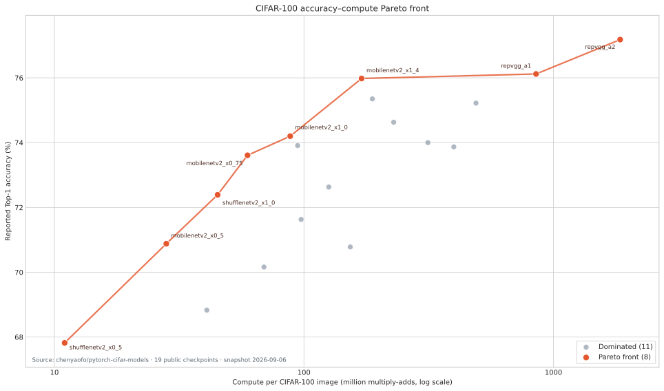

# chenyaofo CIFAR-100 모델 Pareto 분석

기준일: 2026-09-06  
출처: [`chenyaofo/pytorch-cifar-models`의 CIFAR-100 Model Zoo](https://github.com/chenyaofo/pytorch-cifar-models#cifar-100)

## 분석 기준

공개 저장소의 CIFAR-100 표에 있는 체크포인트 19개 전체를 사용했다. 정확도는 높을수록, 이미지 한 장당 연산량은 낮을수록 좋다고 정의했다.

모델 A가 모델 B보다 Top-1 정확도가 같거나 높고 MAdds가 같거나 낮으며, 두 조건 중 하나 이상이 엄격히 우수하면 A가 B를 지배한다. 어떤 다른 모델에도 지배되지 않는 모델을 Pareto front로 판정했다.

원 출처가 제공하는 연산 지표는 `#MAdds(M)`이므로 Pareto 판정에는 이 값을 직접 사용했다. CSV에는 프로젝트의 통일된 규칙인 `1 MAC = 2 FLOPs`로 환산한 MFLOPs도 함께 기록했다. 모든 연산량에 같은 양의 상수 2를 곱하므로 MAdds와 MFLOPs 중 어느 것을 사용해도 Pareto 판정은 같다.



## 결과

19개 체크포인트 중 8개가 Pareto front에 포함된다.

| 순서 | 모델 | Top-1 정확도 (%) | MAdds (M) | MFLOPs |
|---:|---|---:|---:|---:|
| 1 | `shufflenetv2_x0_5` | 67.82 | 10.99 | 21.98 |
| 2 | `mobilenetv2_x0_5` | 70.88 | 28.08 | 56.16 |
| 3 | `shufflenetv2_x1_0` | 72.39 | 45.09 | 90.18 |
| 4 | `mobilenetv2_x0_75` | 73.61 | 59.43 | 118.86 |
| 5 | `mobilenetv2_x1_0` | 74.20 | 88.09 | 176.18 |
| 6 | `mobilenetv2_x1_4` | 75.98 | 170.23 | 340.46 |
| 7 | `repvgg_a1` | 76.12 | 851.44 | 1,702.88 |
| 8 | `repvgg_a2` | 77.18 | 1,850.22 | 3,700.44 |

## 모델 선정 해석

- 최저 연산량 경계는 `shufflenetv2_x0_5`다.
- `mobilenetv2_x0_5`부터 `mobilenetv2_x1_4`까지는 연산량 증가에 따라 Top-1이 비교적 꾸준히 상승한다.
- `mobilenetv2_x1_4`에서 `repvgg_a1`로 이동하면 MAdds가 약 5배 증가하지만 정확도 증가는 0.14%p다.
- `repvgg_a2`는 가장 높은 77.18%를 제공하며 `repvgg_a1`보다 1.06%p 높지만 MAdds는 약 2.17배다.
- ResNet과 VGG 전 모델, `shufflenetv2_x1_5`, `shufflenetv2_x2_0`, `repvgg_a0`는 다른 모델에 지배된다.

PERTINENCE의 전문가 풀을 정할 때 Pareto 여부만으로 최종 선택해서는 안 된다. 전체 정확도와 연산량이 지배되더라도 샘플별 오답 패턴이 상보적이면 시스템 정확도에 기여할 수 있다. 다음 단계에서는 최종 평가 holdout을 열지 않은 상태에서 후보 모델들의 correctness overlap과 cheapest-correct route 분포를 비교해야 한다.

## 산출물

- 전체 19개 모델과 Pareto 판정: [`data/model_catalog.csv`](../data/model_catalog.csv)
- 벡터 그림: [`figures/model_pareto.svg`](../figures/model_pareto.svg)
- 래스터 그림: [`figures/model_pareto.png`](../figures/model_pareto.png)
- 재생성 코드: [`scripts/build_model_pareto.py`](../scripts/build_model_pareto.py)

재생성 명령:

```bash
python3 experiments/cifar100/scripts/build_model_pareto.py
```
